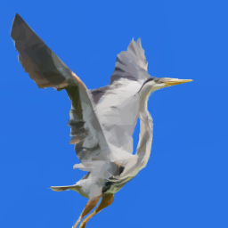

# primitive.nextgen
Electron port of the [primitive.js](https://github.com/ondras/primitive.js) / [primitive.lol](http://primitive.lol/) application.

## How does it look?

Check out the [Masterpieces](https://cielitolindo.de/album/masterpieces/) gallery for several cool samples.

## Building

Written in client-side JavaScript, uses Rollup for JS bundling and LESS for CSS pre-processing.

  1. `git clone https://github.com/cielito-lindo-productions/primitive.nextgen.git`
  1. `npm install`
  1. `npm start`
  
## Saving of images

After the image is calculated you have 2 options to save the result:
 1. The first one which is selected by default is to save the generated image directly as an image file (option Raster image) - for this after calculating a "Save as" dialog shows up in which you can select the name and folder of the file
 1. Alternatively you can choose the option "vector image" and then copy&paste the image date from primitive.nextgen into a file with the ending .svg (eg. via Notepad++ or another text editor). Then open the .svg file in eg. inkscape, make some edits if you want and save the result as an image file with the ending .jpg, .png or any other format
 
Hint: According to issue #2 there seem to occur problems on OS X devices with the first option, so please use the second option then.

## License

[MIT](LICENSE)

## TODO

   1. Batch-processing (Opening, processing and saving of several files at a time)

## Additional resources
	[Github Publishing](https://sevic.dev/notes/electron-forge-publish-github/)

## Hints
Rebuild package-lock.json with `npm i --package-lock-only`
